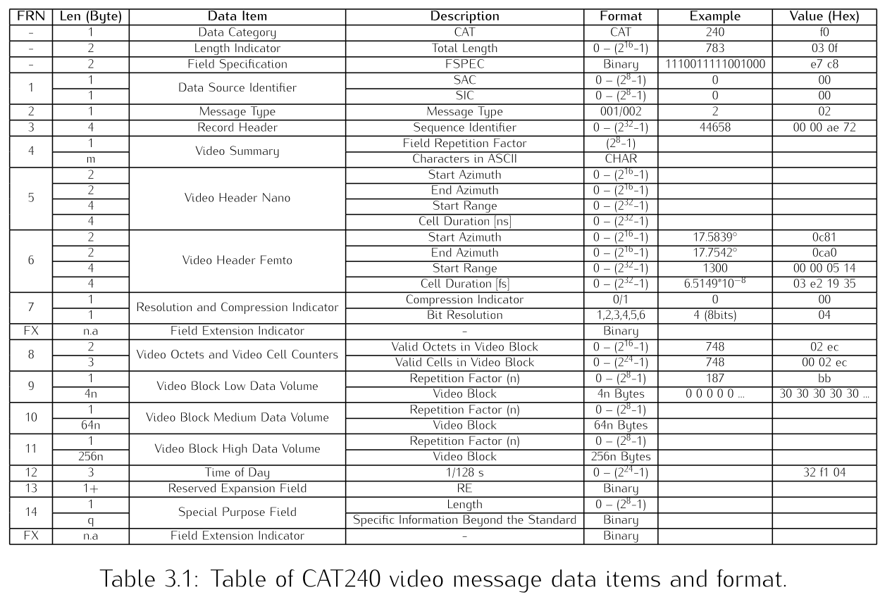

# gosterix

gosterix is an ASTERIX-CAT240 parser built using Go (Golang). This project is designed to parse and process surveillance data following the EUROCONTROL ASTERIX standard, specifically Category 240 (CAT240). Please visit [EUROCONTROL Specification for ASTERIX Category 240](https://www.eurocontrol.int/sites/default/files/content/documents/nm/asterix/20150513-asterix-cat240-v1.3.pdf)

<p align="center">
  
</p>

## Features

- Efficient parsing of Asterix CAT240 messages.
- Built with Go, ensuring high performance and scalability.
- Modular and extensible design for ease of integration into existing systems.


## Prerequisites

Before running the application, ensure the following are installed:

- Go (1.18 or newer)
```bash
  sudo apt install golang-go
```


## Installation

Clone the repository:
```bash
git clone https://github.com/syauqisabili/gosterix.git
```

Navigate to the project directory:
```bash
cd gosterix
```

Install dependencies:
```bash
go mod tidy
```